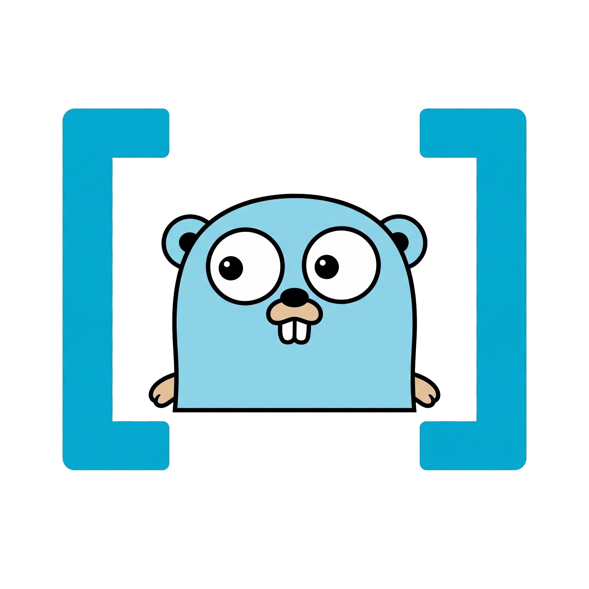

<div align="center">



# Typed

**A type-safe collection toolkit for Go generics.**

[中文版](./README-cn.md) · [Documentation](./docs/README.md)

[](https://go.dev/dl/)
[](./LICENSE)
[](#install)
[](https://go.dev)

</div>

Typed brings Java- and JavaScript-style collection ergonomics to Go without
giving up static typing. Concrete generic types (`ArrayList[T]`,
`LinkedList[T]`, `HashMap[K, V]`, `HashSet[T]`, `Stream[T]`, `Subject[T]`),
fluent transforms (`Filter`, `Map[R]`, `FlatMap[R]`, `Reduce[R]`,
`Take`, `Drop`, `SortBy`, `Distinct`, `Concat`), and the supporting
abstractions (`Optional[T]`, `Result[T]`, `IsNil`, `Equals`) that the rest
of the toolkit is built on. Plus a typed async event stream
(`reactivex.Observable[T]`) with explicit demand, configurable backpressure,
and a first-class multicast `Subject[T]`.

## Why Typed

Go's `for` loop is clear and should remain the default for simple logic.
The trouble starts when a collection goes through several transforms:
nested functions, scattered `if err != nil` blocks, and `(T, bool)` returns
that do not chain.

```go
result := Collect(
    Map(
        Filter(users, func(u User) bool { return u.Age >= 18 }),
        func(u User) string { return u.Name },
    ),
)
```

Typed supports a left-to-right, chainable style:

```go
names := lists.ArrayListOf(users...).
    Filter(func(u User) bool { return u.Age >= 18 }).
    Map(func(u User) string { return u.Name }).
    Collect()
```

For laziness, the same collection becomes a stream explicitly:

```go
profiles := lists.ArrayListOf(users...).
    Stream().
    Filter(isAdult).
    Map(toProfile).
    Take(100).
    Collect()
```

## Highlights

- 🧱 **Concrete generic types** — `ArrayList[T]`, `LinkedList[T]`,
  `HashMap[K, V]`, `HashSet[T]`, `Stack[T]`, `Queue[T]`, `Deque[T]`,
  `Stream[T]`, `Subject[T]`. No runtime type assertions, no `any`-shaped
  surprises.
- 🪄 **Fluent transforms** — `Filter`, `Map[R]`, `FlatMap[R]`, `Reduce[R]`,
  `Take`, `Drop`, `Distinct`, `SortBy`, `Concat`. All return concrete
  types under Go 1.27's generic methods.
- 🟢 **Optional / Result** — `Optional[T]` for "may be absent",
  `Result[T]` for "may fail". Both bridge cleanly to `(T, error)` and
  compose with the collection API.
- 📡 **Typed async streams** — `reactivex.Observable[T]` with explicit
  demand (`Request(n)`), per-subscription backpressure (`WithBuffer`,
  `OverflowStrategy`), and a hot multicast `Subject[T]`.
- 🧠 **Smart equality** — `objects.Equals[T]` understands
  `func (T) Equal(T) bool`, normalises nil-vs-empty slices / maps, and
  is nil-safe for typed-nil pointers.
- 🪶 **Bounded memory** — head-offset `ArrayList` with periodic
  compaction, slot zeroing on `Stack.Pop` and `Remove*`, so popped
  references do not leak through the backing array.

## Install

```bash
go get github.com/qianwj/typed/collections
go get github.com/qianwj/typed/utils/option
go get github.com/qianwj/typed/utils/result
go get github.com/qianwj/typed/reactivex
go get github.com/qianwj/typed/control
go get github.com/qianwj/typed/utils/objects
go get github.com/qianwj/typed/utils/json
```

Each sub-package is its own Go module, so you can pull in only what you
use. Requires **Go 1.27+** for generic methods on concrete types.

## Quick start

```go
import (
    "github.com/qianwj/typed/collections"
    "github.com/qianwj/typed/collections/lists"
    "github.com/qianwj/typed/utils/option"
    "github.com/qianwj/typed/utils/result"
)

// Eager transform
adults := lists.ArrayListOf(users...).
    Filter(func(u User) bool { return u.Age >= 18 }).
    Map(func(u User) string { return u.Name }).
    Collect()

// Optional-based access — no (T, bool) dance
first := adults.First().OrElse("(none)")

// Linear structures
s := collections.NewStack[int]()
s.Push(1); s.Push(2); s.Push(3)
top := s.Pop().OrElse(0) // 3

// Result: thread a (T, error) through combinators
v, err := result.Wrap(loadConfig(path)).
    MapError(func(err error) error { return fmt.Errorf("config %s: %w", path, err) }).
    Map(func(b []byte) Config { return parseConfig(b) }).
    Unwrap()
if err != nil { return err }
use(v)
```

## Table of contents

- [Design principles](#design-principles)
- [What ships today](#what-ships-today)
- [Documentation](#documentation)
- [Java / JavaScript mapping](#java--javascript-mapping)
- [Laziness and execution boundaries](#laziness-and-execution-boundaries)
- [Memory model](#memory-model)
- [Concurrency](#concurrency)
- [Error handling](#error-handling)
- [Go version](#go-version)
- [Roadmap](#roadmap)
- [License](#license)

## Design principles

- **Type safety first.** Use Go generics and avoid `any`, reflection,
  and runtime type assertions wherever possible. `Optional[T]` carries
  an explicit `present` flag rather than relying on a nil check, so it
  works for any `T` including value types such as `int`, `string`, and
  `struct{}`.
- **Concrete types over interfaces.** `ArrayList[T]` and the rest are
  concrete generic types, not interfaces. Go 1.27's generic methods
  (`Map[R]`, `FlatMap[R]`, `Reduce[R]`) only work on concrete
  receivers; an interface would break fluent chaining.
- **Optional-based access.** Every accessor that can fail by absence
  returns `option.Optional[T]` rather than `(T, bool)`. The convention
  is uniform across `ArrayList.Get / First / Last / Find / MinBy / MaxBy / RemoveFirst / RemoveLast`, `LinkedList`, `Stack`, `Queue`, and `Deque`.
- **Bounded memory.** `ArrayList` uses a head-offset layout with
  periodic compaction so the retained capacity of a long-running
  head-drained list is bounded by the high-water mark of in-flight
  elements plus a constant, not by the all-time maximum the list ever
  saw. `Stack.Pop`, `ArrayList.RemoveFirst / RemoveLast`, and
  `Deque.PopFront / PopBack` zero the freed slot so the runtime's
  reachability walk does not keep popped references alive.
- **Optional laziness.** Collection operations are eager; `Stream[T]`
  is the explicit lazy layer, backed by Go's `iter.Seq[T]`.
- **Composability.** Collections, iterators, and `Stream` can be
  combined into new data sources; the snapshot contract on `Stream()`
  keeps mutations from leaking into in-flight pipelines.
- **Early termination.** `First`, `Any`, `All`, `Find`, `Take`, and
  the `Optional`-returning accessors stop as soon as the answer is
  known.
- **Go style.** Do not copy every Java Stream semantic blindly; simple
  logic should remain easy to write with `for range`. Typed is
  opt-in: existing code that prefers slices and maps is unaffected.

## What ships today

### Collection types

| Type | Kind | Source | Notes |
| --- | --- | --- | --- |
| `ArrayList[T]` | Concrete generic struct | `collections/lists` | Head-offset `[]T`; O(1) `Add` / `AddFirst` / `RemoveFirst` / `RemoveLast`; periodic compaction at head ≥ 64. |
| `LinkedList[T]` | Concrete generic struct | `collections/lists` | Doubly-linked; O(1) head / tail, O(i) random access. |
| `HashMap[K, V]` | Concrete generic struct | `collections/maps` | Open-addressed hash table; `K comparable`. |
| `HashSet[T]` | Concrete generic struct | `collections/sets` | `T comparable`; built on the same hash-table machinery. |
| `Stack[T]` | Concrete generic struct | `collections` | Single-ended LIFO; `[]T` with explicit slot zeroing on `Pop`. |
| `Queue[T]` | Concrete generic struct | `collections` | Single-ended FIFO; thin wrapper over `ArrayList[T]`. |
| `Deque[T]` | Concrete generic struct | `collections` | Double-ended; thin wrapper over `LinkedList[T]`. All operations are strict O(1). |
| `Stream[T]` | Concrete generic struct | `collections/stream` | Lazy, single-use pipeline over `iter.Seq[T]`. |

### Parent-package constructors

| Function | Source | Notes |
| --- | --- | --- |
| `Range[T constraints.Integer](start, end T) Stream[T]` | `collections` | Lazy iota-style `[start, end)` stream. |

### Abstraction types

| Type | Source | Notes |
| --- | --- | --- |
| `option.Optional[T]` | `utils/option` | Present / absent value, no nil check on `T`. |
| `result.Result[T]` | `utils/result` | Success / failure; `Unwrap` returns `(T, error)`, `Wrap` is the forward bridge from `(T, error)`, `Recover` does error-aware fallback that always returns a `T`. |
| `json.Encode[T] / Decode[T]` | `utils/json` | `encoding/json/v2`-backed `Result`-style codec. |
| `objects.Equaler` (interface, optional) | `utils/objects` | Hint interface `Equal(any) bool`; not required for `Equals` to dispatch. |
| `objects.IsNil[T]`, `objects.Equals[T]` | `utils/objects` | Reflection-based nil check and equality dispatch (handles typed nil, `func (T) Equal(T) bool`, `time.Time.Equal`). |

### Control flow

| Type / function | Source | Notes |
| --- | --- | --- |
| `control.Repeat(times, f)` / `RepeatE(times, f) (int, error)` | `control` | "Do this N times" loops; `RepeatE` stops at the first non-nil error and returns the number of successful iterations. |
| `match.Pattern[T]`, `match.Value[T]`, `match.Type(any)` | `control/match` | First-match-wins pattern matching: `Pattern[T]` for value tests, `Type` for dynamic-type dispatch. |

### Reactive streams

| Type | Source | Notes |
| --- | --- | --- |
| `reactivex.Observable[T]`, `Publisher[T]`, `Subscriber[T]` | `reactivex` | Typed async stream with explicit demand (`Subscription.Request(n)`) and `OnError` / `OnComplete` terminals. |
| `reactivex.Subject[T]` | `reactivex` | Hot multicast publisher and subscriber; configured with `WithBuffer` / `WithOverflow`. |
| `reactivex.OverflowStrategy` | `reactivex` | `OverflowBlock` / `OverflowDropLatest` / `OverflowDropOldest` / `OverflowKeepLatest` / `OverflowError`. |
| Sources: `Just`, `FromSlice`, `FromChannel`, `FromChannelWithOptions`, `FromSeq`, `Create`, `Interval` | `reactivex` | Cold and hot source constructors. |
| Operators: `Map[R]`, `Filter`, `Take`, `Skip`, `Scan[R]`, `Reduce` | `reactivex` | All wrapping-style; no goroutines or queues of their own. |

## Documentation

Per-package API reference and examples, in English and Chinese:

- [docs/README.md](./docs/README.md) — index
- [collections](./docs/collections/README.md) — `ArrayList`, `LinkedList`, `HashMap`, `HashSet`, `Stack`, `Queue`, `Deque`, `Stream`, `Range`
- [control](./docs/control/README.md) — `Repeat` / `RepeatE` and `control/match`
- [reactivex](./docs/reactivex/README.md) — `Observable`, `Subject`, backpressure, operators
- [utils/option](./docs/option/README.md) — `Optional[T]`
- [utils/result](./docs/result/README.md) — `Result[T]`
- [utils/objects](./docs/utils/objects/README.md) — `IsNil`, `Equals`
- [utils/json](./docs/utils/json/README.md) — `Encode` / `Decode` on `encoding/json/v2`

## Java / JavaScript mapping

| Java / JavaScript | Typed |
| --- | --- |
| `stream()` | `ArrayListOf(...).Stream()` |
| `filter` / `where` | `Filter` |
| `map` / `select` | `Map` |
| `flatMap` / `selectMany` | `FlatMap` |
| `distinct` | `Distinct` |
| `sorted` | `Sort` / `SortBy` |
| `limit` / `take` | `Take` |
| `skip` / `drop` | `Drop` |
| `findFirst` / `find` | `First` / `Find` (returns `Optional[T]`) |
| `anyMatch` / `some` | `Any` |
| `allMatch` / `every` | `All` |
| `noneMatch` | `None` |
| `reduce` | `Reduce` |
| `collect(toList())` | `Collect` |
| `forEach` | `ForEach` |
| `Optional.of` / `ofNullable` | `option.Of` / `option.OfNullable` |
| `Optional.orElse` | `OrElse` |
| `Stream` lazy | `Stream[T]` |
| `IntStream.range` | `Range(start, end) Stream[T]` |
| `Deque` (Java) | `Deque[T]` (LinkedList-backed) |

Typed does not copy the Java or JavaScript runtime model. It borrows
their collection-processing style while preserving Go's static typing,
explicit errors, and straightforward control flow.

## Laziness and execution boundaries

A typical `Stream` pipeline looks like:

```text
source → intermediate operation → intermediate operation → terminal operation
```

For example:

```go
adults := lists.ArrayListOf(users...).
    Stream().
    Filter(isAdult).
    Map(toProfile).
    Take(100).
    Collect()
```

Before `Collect`, `Filter`, `Map`, and `Take` only describe the
pipeline. The terminal operation starts consumption, and `Take(100)`
can stop the underlying source as soon as enough values have been
produced. `Stream()` creates a snapshot of the source at call time, so
later mutations to the source collection do not affect the in-flight
pipeline.

## Memory model

`ArrayList` stores the live range in `items[head:head+size]` and folds
the discarded prefix back to zero once `head >= 64`. The retained
capacity of a long-running head-drained list is therefore bounded by
the high-water mark of in-flight elements plus 64, not by the all-time
maximum the list ever saw. Reference elements popped from the front
are eligible for GC as soon as `RemoveFirst` zeros the freed slot. The
reference-handling tests in `collections/lists/arraylist_test.go` and
`collections/{stack,queue,deque}_test.go` use `runtime.SetFinalizer`
to assert that all popped boxes' finalizers run.

`Stack.Pop` is the slice-backed equivalent: it shrinks the backing
array and explicitly zeros the popped slot, so a `Stack[T]` of
pointers does not leak references through out-of-range slots.

## Concurrency

None of the collection types are safe for concurrent mutation. The
standard Go pattern — a single goroutine owns the collection,
communication happens over channels — applies unchanged. `Stream` is
not parallel by default; ordinary `Map` will not silently become
concurrent. The toolkit does not introduce a new concurrency model; it
follows Go's explicit one.

## Error handling

`Result[T]` is the typed `(T, error)` carrier:

```go
v, err := result.Success(42).Unwrap()
if err != nil { return err }

port, _ := result.Wrap(lookupPort()).
    Recover(func(err error) int { return 8080 }).
    Unwrap() // err is always nil
```

`Recover` always returns a `T`; surface a fresh error by ending the
chain with `Unwrap` instead.

For collection pipelines that need to surface errors, the recommended
pattern is to convert the error path into an absent `Optional[T]`
(e.g. `OfNullable` on a lookup that returns `(T, error)`) and keep the
success path on the regular fluent API.

## Go version

The current modules use **Go 1.27**:

```text
go 1.27.1
```

Go 1.23 introduced `iter.Seq`, `iter.Seq2`, and `for range` support
for function iterators. Go 1.27's generic methods make fluent APIs
such as `Stream[T].Map[R]`, `Optional[T].Map[R]`, and
`Result[T].Map[R]` possible.

## Roadmap

Done:

- [x] `ArrayList[T]`, `LinkedList[T]`, `HashMap[K, V]`, `HashSet[T]` with
      fluent methods.
- [x] Eager collection operations: `Filter`, `Map[R]`, `FlatMap[R]`,
      `Reduce[R]`, `Collect`, `ForEach`, `Peek`, `Concat`.
- [x] Order-dependent operations on lists: `Get`, `Insert`, `RemoveAt`,
      `First`, `Last`, `Find`, `Take`, `Drop`, `Distinct`, `SortBy`,
      `MinBy`, `MaxBy`.
- [x] Optional-based access: `Get` / `First` / `Last` / `Find` /
      `MinBy` / `MaxBy` / `RemoveFirst` / `RemoveLast` and `Stack` /
      `Queue` / `Deque` `Pop` / `Peek` / `Front` / `Back` return
      `Optional[T]`.
- [x] `Stream[T]` adapter backed by `iter.Seq[T]`, with
      early-terminating terminals.
- [x] Linear structures: `Stack[T]`, `Queue[T]`, `Deque[T]`.
- [x] Parent-package helpers: `Range[T constraints.Integer](start, end T)
      Stream[T]` for iota-style integer sequences.
- [x] `Option[T]` / `Result[T]` / `Equaler` / `IsNil[T]` / `Equals[T]`
      utilities.
- [x] `control.Repeat` / `RepeatE` and `control/match` pattern matching.
- [x] `reactivex` package: `Observable[T]` / `Publisher[T]` /
      `Subscriber[T]`, `Subject[T]`, `WithBuffer` / `WithOverflow`
      backpressure, `Map` / `Filter` / `Take` / `Skip` / `Scan` /
      `Reduce` operators.
- [x] `utils/json` Result-style codec on top of `encoding/json/v2`.
- [x] Bounded memory: head-offset `ArrayList` with periodic compaction,
      slot-zeroing on `Stack.Pop` and the list `Remove*` paths.
- [x] Tests with race detector, 100% statement coverage on the
      actively-developed files.

Open:

- [ ] Error-aware collection operations (`MapE`, `FilterE`, `CollectE`)
      as a first-class pipeline alternative to `Result[T]`-per-element.
- [ ] Benchmarks for `ArrayList` head-side ops, `LinkedList`
      iteration, `HashMap` resize behaviour, and `Stream` pipeline
      overhead.
- [ ] Iterators (`iter.Seq[T]`) as a first-class output of the
      collection types, parallel to `Stream()`.

## License

This project is licensed under the [MIT License](./LICENSE).
